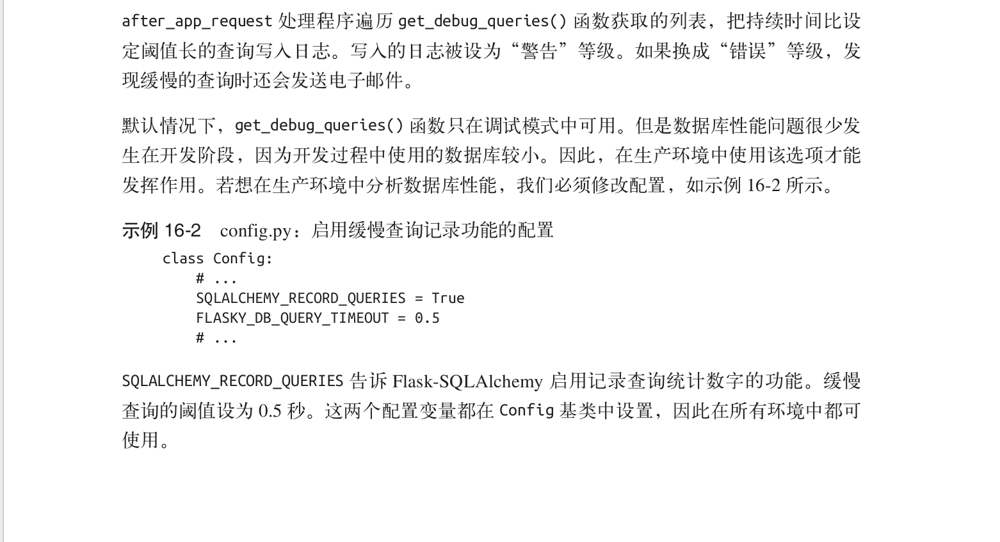

##some note about flask
###some suggestions
1. 为flask应用创建一个单独的虚拟环境，用virtualenv。
2. 尽可能的使用扩展实现而不是自己造轮子。

###some useful flask-plugin
##### Flask-Script
Flask-Script 是一个 Flask 扩展,为 Flask 程序添加了一个命令行解析器。Flask-Script 自带了一组常用选项,而且还支持自定义命令。
安装
```
pip install flask-script
```
使用
```python
# coding: utf-8
# hello.py
from flask.ext.script import Manager
manager = Manager(app)
# ...
if __name__ == '__main__':
manager.run()
```
##### Flask-SQLAlchemy
Flask-SQLAlchemy 是一个 Flask 扩展,简化了在 Flask 程序中使用 SQLAlchemy 的操作。SQLAlchemy 是一个很强大的关系型数据库框架,支持多种数据库后台。SQLAlchemy 提供了高层 ORM,也提供了使用数据库原生 SQL 的低层功能。
安装
```
pip install flask-sqlalchemy
```
##### Flask-Migrate
SQLAlchemy的主力开发人员编写了一个迁移框架,称为 [Alembic](https://alembic.readthedocs)。除了直接使用Alembic之 外,Flask程序还可使用[Flask-Migrate](http://flask-migrate.readthedocs.org/en/latest/)扩展。这个扩展对 Alembic 做了轻量级包装,并集成到 Flask-Script 中,所有操作都通过 Flask-Script 命令完成。
安装
```
pip install flask-migrate
```
使用
```python
from flask.ext.migrate import Migrate, MigrateCommand
# ...
migrate = Migrate(app, db)
manager.add_command('db', MigrateCommand)
```
##### Flask-Email
##### Werkzeug
Werkzeug 中的 security 模块能够很方便地实现密码散列值的计算。这一功能的实现只需要两个函数,分别用在注册用户和验证用户阶段。
generate_password_hash(password, method= pbkdf2:sha1 , salt_length=8) :这个函数将原始密码作为输入,以字符串形式输出密码的散列值,输出的值可保存在用户数据库中。
method 和 salt_length 的默认值就能满足大多数需求。check_password_hash(hash, password) :这个函数的参数是从数据库中取回的密码散列值和用户输入的密码。返回值为 True 表明密码正确。
example
```python
# coding: utf-8
# app/models.py
from werkzeug.security import generate_password_hash, check_password_hash
class User(db.Model):
	# ...
	password_hash = db.Column(db.String(128))
    
	@property
	def password(self):
		raise AttributeError('password is not a readable attribute')

	@password.setter
	def password(self, password):
		self.password_hash = generate_password_hash(password)
        
	def verify_password(self, password):
		return check_password_hash(self.password_hash, password)
```
##### Flask-Login
用户登录程序后,他们的认证状态要被记录下来,这样浏览不同的页面时才能记住这个状态。Flask-Login 是个非常有用的小型扩展,专门用来管理用户认证系统中的认证状态,且不依赖特定的认证机制
install
```
pip install flask-login
```
example
```python
# coding: utf-8
# app/models.py

from flask.ext.login import UserMixin

class User(UserMixin, db.Model):
	__tablename__ = 'users'
	id = db.Column(db.Integer, primary_key = True)
	email = db.Column(db.String(64), unique=True, index=True)
	username = db.Column(db.String(64), unique=True, index=True)
	password_hash = db.Column(db.String(128))
	role_id = db.Column(db.Integer, db.ForeignKey('roles.id'))
```

```python
# coding: utf-8
# app/__init__.py
from flask.ext.login import LoginManager

login_manager = LoginManager()
login_manager.session_protection = 'strong'
login_manager.login_view = 'auth.login'

def create_app(config_name):
	# ...
	login_manager.init_app(app)
```
##### itsdangerous
itsdangerous 提供了多种生成令牌的方法。其中, TimedJSONWebSignatureSerializer 类生成具有过期时间的 JSON Web 签名(JSON Web Signatures,JWS)。这个类的构造函数接收的参数是一个密钥,在 Flask 程序中可使用 SECRET_KEY 设置。
dumps() 方法为指定的数据生成一个加密签名,然后再对数据和签名进行序列化,生成令牌字符串。 expires_in 参数设置令牌的过期时间,单位为秒。
为了解码令牌,序列化对象提供了 loads() 方法,其唯一的参数是令牌字符串。这个方法会检验签名和过期时间,如果通过,返回原始数据。如果提供给 loads() 方法的令牌不正确或过期了,则抛出异常。

##### forgerypy
用来生成虚拟数据.
##### Flask-HTTPAuth
因为 REST 架构基于 HTTP 协议,所以发送密令的最佳方式是使用 HTTP 认证,基本认证和摘要认证都可以。在 HTTP 认证中,用户密令包含在请求的 Authorization 首部中。
HTTP 认证协议很简单,可以直接实现,不过 Flask-HTTPAuth 扩展提供了一个便利的包装,可以把协议的细节隐藏在修饰器之中,类似于 Flask-Login 提供的 login_required 修饰器。
##### Flask-SSLify
让程序拦截发往 http:// 的请求,重定向到https://, 一操作可使用 Flask-SSLify 扩展完成。
```python
def create_app(config_name):
	# ...
	if not app.debug and not app.testing and not app.config['SSL_DISABLE']:
		from flask.ext.sslify import SSLify
		sslify = SSLify(app)
# ...
```
##### for TEXT
PageDown:使用 JavaScript 实现的客户端 Markdown 到 HTML 的转换程序。
Flask-PageDown:为 Flask 包装的 PageDown,把 PageDown 集成到 Flask-WTF 表单中。
Markdown:使用 Python 实现的服务器端 Markdown 到 HTML 的转换程序。
Bleach:使用 Python 实现的 HTML 清理器。

#### Testing
Python 提供了一个优秀的代码覆盖工具,称为 coverage,你可以使用 pip 进行安装:
```
pip install coverage
```
test with flask app client, and test with selenium.

#### 性能
##### 记录影响性能的缓慢数据库查询
Flask-SQLAlchemy
提供了一个选项,可以记录请求中执行的与数据库查询相关的统计数字。在示例 16-1 中,我们可以看到如何使用这个功能把慢于设定阈值的查询写入日志。



#### 分析源码
性能问题的另一个可能诱因是高 CPU 消耗,由执行大量运算的函数导致。源码分析器能找出程序中执行最慢的部分。分析器监视运行中的程序,记录调用的函数以及运行各函数所消耗的时间,然后生成一份详细的报告,指出运行最慢的函数。
Flask 使用的开发 Web 服务器由 Werkzeug 提供,可根据需要为每条请求启用 Python 分析器。示例 16-3 向程序中添加了一个新命令,用来启动分析器。
```python
# coding: utf-8
# manage.py
@manager.command
def profile(length=25, profile_dir=None):
	"""Start the application under the code profiler."""
	from werkzeug.contrib.profiler import ProfilerMiddleware
	app.wsgi_app = ProfilerMiddleware(app.wsgi_app, restrictions=[length],
	profile_dir=profile_dir)
	app.run()
```
#### 部署
##### nginx+supervisor+gunicorn
##### 配置日志
```python
# coding: utf-8
# config.py
class UnixConfig(ProductionConfig):
	@classmethod
	def init_app(cls, app):
		ProductionConfig.init_app(app)
		# 写入系统日志
		import logging
		from logging.handlers import SysLogHandler
		syslog_handler = SysLogHandler()
		syslog_handler.setLevel(logging.WARNING)
		app.logger.addHandler(syslog_handler)
```